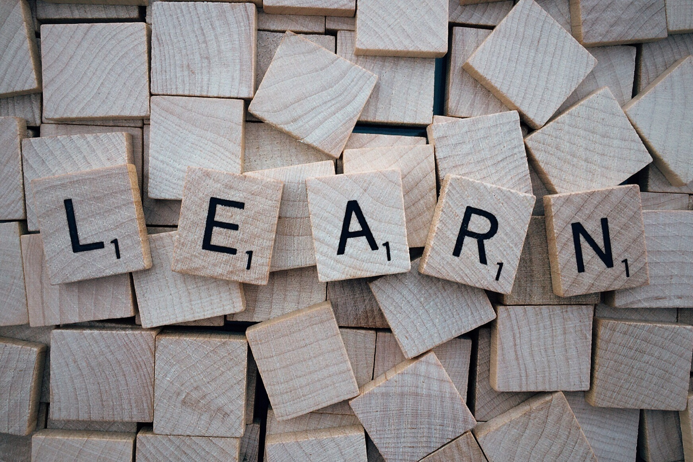

{
    "title": "Reading Blogs Will Change Your Life. Find Out How!",
    "description": "Discover the transformative power of blogs! They provide in-depth content, flexibility, and reliability, while complementing the strengths of YouTube videos. Embrace both mediums for a well-rounded learning experience and unlock your full potential.",
    "date": "2023-06-10T17:10:41+06:00",
    "hidden": false,
    "comments": true,
    "draft": false,
    "image": "blog_pexels.jpg",
    "categories": ["ai"]
}

Are you in search of an exhilarating adventure in the realm of knowledge? Look no further than the mesmerizing world of blogs. These flashy digital narratives are the key to unlocking wisdom, insights, and personal growth.

While AI-powered language models like ChatGPT have made impressive strides, they still have limitations in several fundamental aspects, making blogs an indispensable resource for eagered learners and passionate enthusiasts. The next sections covers what ChatGPT's fundamental limitations are.

Blogs are like a treasure trove of learning resources that cater to everyone, whether you’re a newbie just starting out or a seasoned pro with years of experience. They have something valuable to offer at every level. In this blog, we will learn why blogs are very good learning resources.

## The Pinnacle of Blogs over Videos
In an era dominated by video content, the resolute power of blogs remains unshaken. While videos offer visual appeal and interactive elements, they often lack the depth and precision found in well-crafted blog posts. Blogs grant readers the luxury of absorbing information at their own pace, revisiting complex concepts, and delving into specific sections without the constraint of a fixed timeline. The written word fosters clarity, precision, and comprehensive exploration in ways that videos simply cannot replicate.

## The Limitations of YouTube Videos
YouTube videos, while popular and valuable for beginner programmers, have their limitations. Due to time constraints, some videos may provide a more concise or introductory understanding of programming concepts. However, there are also many YouTube channels and creators that offer in-depth tutorials and explanations on advanced programming topics. Finding high-quality YouTube content on advanced programming topics can be a challenge, as the majority of tutorials tend to focus on beginner-level material. In contrast, blogs often have a diverse range of content, including advanced tutorials, case studies, and deep dives into specific programming concepts.

## Lack of Interactivity and Flexibility
One limitation of YouTube videos is their lack of interactivity. Viewers passively consume the content without the ability to engage, ask questions, or seek clarification in real-time. Additionally, YouTube videos are linear in nature, making it challenging to revisit specific sections or navigate to topics of interest easily. Blogs, on the other hand, offer the flexibility of interacting with the content, leaving comments, and revisiting specific sections at one's convenience.

## Quality Control and Reliability
While YouTube hosts a vast array of programming tutorials, it can be difficult to discern the quality and reliability of the content. Anyone can create and upload videos, leading to inconsistencies in the accuracy of the information provided. Conversely, some blogs often have a more rigorous editorial process, ensuring the accuracy and reliability of the content through peer review, fact-checking, and a comprehensive approach to presenting information.

## The Strengths of YouTube: Embracing Visual Learning
Despite its limitations, YouTube offers unique strengths that make it a valuable platform for learning. One of its greatest advantages is the visual appeal it provides. Videos allow learners to see programming concepts in action, making it easier to understand and grasp complex ideas. Visual demonstrations can be particularly beneficial for beginners who prefer a more hands-on approach to learning. Additionally, YouTube offers a vast library of content created by various creators, providing diverse perspectives and teaching styles. This allows learners to explore different approaches and find the one that resonates with them the most. By leveraging the strengths of YouTube alongside blogs and other resources, learners can create a well-rounded learning experience that combines the power of visual demonstrations with the depth and precision offered by written content.

## The Perils of Misinformation: ChatGPT and Beginner Learners
For those embarking on their learning journey, ChatGPT can be a useful tool by offering swift answers and explanations. However, there is a risk of it presenting misleading or inaccurate content, particularly for beginners. Blogs, in contrast, provide structured, step-by-step tutorials that guide novices through their learning process, minimizing confusion and ensuring a solid foundation of knowledge.

## The Limitations of Language Models: ChatGPT's Knowledge Cutoff
While ChatGPT's capabilities are awe-inspiring, it operates within the confines of a knowledge cutoff point. It's training data only spans until September 2021, leaving it unaware of the latest breakthroughs and real-time events. As a result, ChatGPT may not always provide the most current and accurate information. However, blogs are crafted by human authors who actively engage with the ever-changing world, and have the potential to provide relevant and up-to-date content. But still it's important to consider the credibility of the authors and the specific blog when evaluating the accuracy and timeliness of the information.

## The Peril of Inaccuracy: ChatGPT's Fallible Nature
Despite its ability to generate coherent text and mimic human conversation, ChatGPT is not infallible. It relies on pre-existing data, which may inadvertently lead to the propagation of incorrect information. Conversely, some blogs, especially those composed by subject matter experts or dedicated enthusiasts, may undergo fact-checking processes to ensure accuracy.

## Embracing the Wholeness of Learning Resources
While the remarkable capabilities of ChatGPT and its counterparts cannot be denied, they do not supplant the profound significance of blogs in the pursuit of knowledge. Blogs, with their human authors, up-to-date content, accuracy, and tailored guidance, remain an invaluable companion for eagered learners and passionate enthusiasts.

## Blogs: The Gateway to Free Learning Materials
The allure of blogs lies not only in their reliability but also in their accessibility. The overwhelming majority of blogs are freely available, democratizing knowledge and dismantling barriers to learning. Whether one seeks to acquire new skills, explore personal interests, or seek guidance, blogs offer an abundant source of information, only a few clicks away. Their versatility and affordability make them an unrivaled treasure trove for lifelong learners.

## Blogs: Alive and Evolving
Contrary to naysayers, blogs are far from being relegated to the annals of the past. In response to the ever-changing digital landscape, blogs have evolved to incorporate multimedia elements, interactive features, and enhanced user experiences. They now provide an immersive and engaging learning environment that caters to the diverse needs of modern-day learners. Blogs are not only alive; they are flourishing.

## The Timeless Value of the Traditional Approach
In an era where people are blown up with AI advancements and automation, the traditional approach to knowledge acquisition retains its intrinsic value. Blogs, with their human touch and unique perspectives, forge connections that AI-powered language models like ChatGPT won't be able to fully emulate in the near future. This traditional path nurtures critical thinking, fosters creativity, and encourages profound engagement with the subject matter, resulting in a more enriching and meaningful learning experience.

## Conclusion: Embrace the Journey with Blogs
In conclusion, while the remarkable capabilities of ChatGPT and its counterparts cannot be denied, they do not supplant the profound significance of blogs in the pursuit of knowledge. Blogs, with their human authors, up-to-date content, accuracy, and tailored guidance, remain an invaluable companion for eager learners and passionate enthusiasts. So, let us wholeheartedly embrace the boundless potential of blogs as they continue to illuminate our path to enlightenment and inspire countless minds along the way. By integrating AI advancements with traditional learning methods, learners can combine the strengths of blogs, YouTube videos, and other mediums to foster a holistic and well-rounded learning journey in the world of programming.
